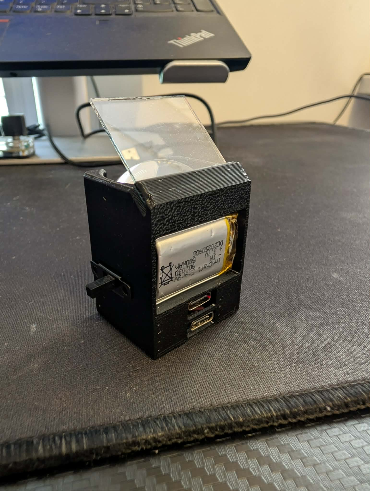
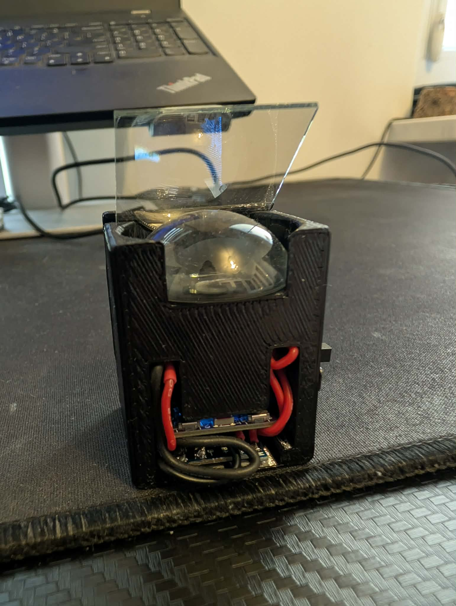
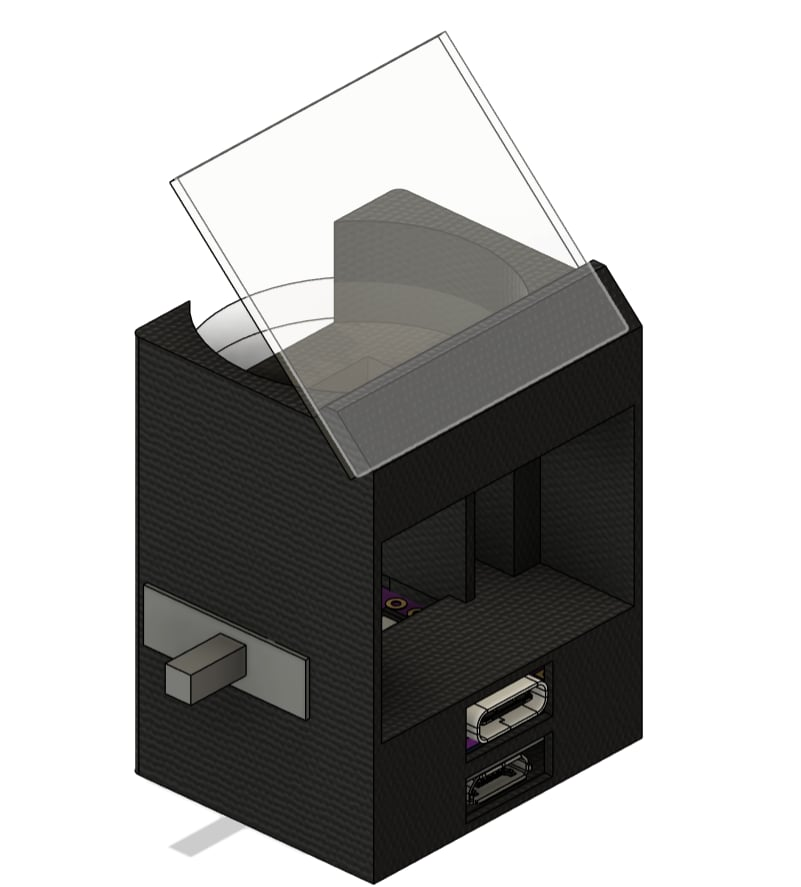
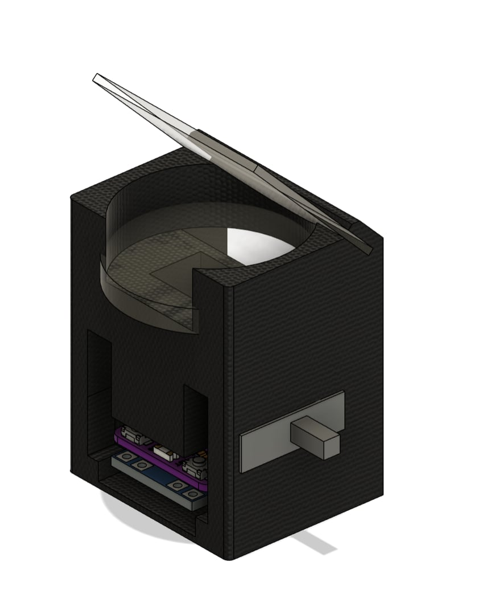
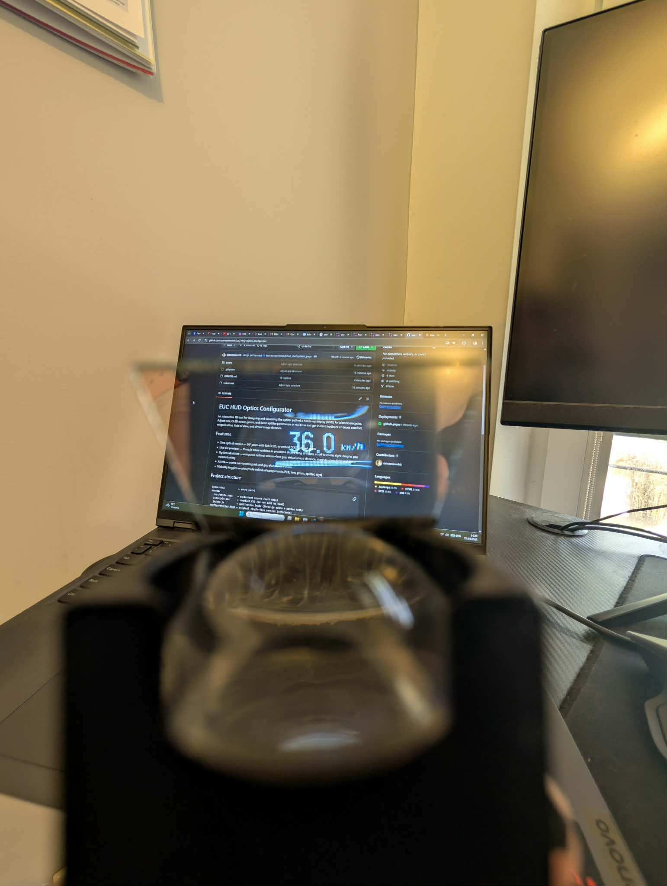

# EUC HUD Optics Configurator

An interactive 3D tool for designing and validating the optical path of a heads-up display (HUD) for electric unicycles. Adjust lens, OLED screen, prism, and beam splitter parameters in real time and get instant feedback on focus comfort, magnification, field of view, and virtual image distance.

## Features

- **Two optical modes** — 90° prism with flat OLED, or vertical OLED without prism
- **Live 3D preview** — Three.js scene updates as you move sliders; drag to rotate, scroll to zoom, right-drag to pan
- **Optics calculator** — computes optimal screen→lens gap, virtual image distance, magnification, FoV, and focus comfort rating
- **Alerts** — warns on vignetting risk and gap deviations > 3 mm
- **Visibility toggles** — show/hide individual components (PCB, lens, prism, splitter, rays)

## Project structure

```
index.html           ← entry point
assets/
  scss/style.scss    ← stylesheet source (edit this)
  css/style.css      ← compiled CSS (do not edit by hand)
  js/app.js          ← application logic (Three.js scene + optics math)
configuratorApp.html ← original single-file version (reference)
```

## Local development

Open `index.html` directly in a browser — no server required.

To edit styles, compile SCSS after making changes:

```bash
npm install          # first time only
npm run sass         # compile once
npm run sass:watch   # recompile on save
```

## GitHub Pages

The app is hosted as a static site 
https://ostrzeniewskit.github.io/EUC-HUD-Optics-Configurator/

## Parameters

| Panel | Controls |
|---|---|
| Lens | Diameter, focal length, thickness |
| Screen (OLED) | Active width and height |
| PCB | Length, width, thickness; prism size (prism mode only) |
| Spacing | Screen→lens gap, lens→splitter distance, target virtual distance |
| Beam splitter | Size, thickness |

## Focus comfort guide

| Rating | Virtual image distance | Notes |
|---|---|---|
| very close | < 300 mm | Eye strain — avoid |
| arm length | 300–800 mm | Some effort — short use only |
| relaxed ✓ | 800 mm–3 m | Eye nearly fully relaxed — best |
| far/∞ ✓ | > 3 m | Fully relaxed — excellent |
| real img! | — | OLED past focal length — image inverted, unusable |

## HUD in project

| | |
|---|---|
|  |  |
|  |  |


